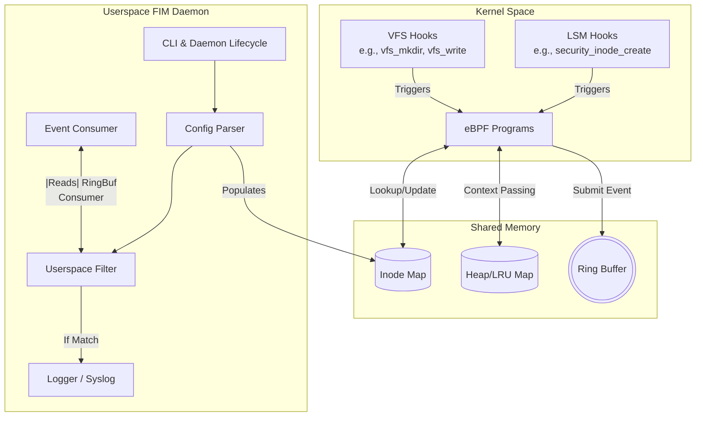

# FIM Architecture Overview

The File Integrity Monitoring (FIM) tool is designed with a split architecture, leveraging **eBPF (Extended Berkeley Packet Filter)** in the Linux Kernel for high-performance event gathering and a **Userspace Daemon** in C++ for processing, filtering, and logging these events.

## High-Level Architecture

The architecture consists of three main boundaries: the **Linux Kernel** where the eBPF programs live, the **eBPF Maps / Ring Buffer** which act as shared memory, and the **Userspace Daemon** which manages the lifecycle and processes events.

## Components Breakdown

### 1. eBPF Programs (Kernel Space)
Compiled into `fentry_bpf.skel.h`, these programs attach to kernel functions (kprobes/kretprobes) such as `vfs_mkdir`, `vfs_fallocate`, `vfs_write`, `security_inode_create`, etc.
*   **Purpose:** To monitor file operations at the lowest level with minimal overhead.
*   **Logic:** When a filesystem operation occurs, the eBPF program checks if the affected directory/file's inode is present in the `InodeMap`. If it is being monitored, an event structure is populated and sent to the Ring Buffer.

### 2. eBPF Maps (Shared Memory)
*   **InodeMap:** A hash map storing the inodes of the directories and files we want to monitor. The userspace daemon populates this based on the configuration file.
*   **LruMap (Heap Map):** Used to pass state between the entry of a kernel function (kprobe) and its return (kretprobe). For example, storing the file path before it's created, then retrieving it when the creation succeeds.
*   **Ring Buffer:** A high-performance queue used to stream event structures from the kernel to userspace asynchronously.

### 3. Userspace FIM Daemon
The daemon (`fim` executable) orchestrates the entire process.
*   **Daemon Initialization (`daemon.cpp`):** Handles standard double-forking daemonization, detaches from the terminal, handles signals, and manages the PID file for state tracking.
*   **Parser (`parser.cpp`):** Reads `/etc/fim/config.txt` using a custom syntax (D: /path, E: /exclude) and populates the `InodeMap` via libbpf.
*   **Event Consumer (`fim.cpp` & `event.cpp`):** A dedicated thread polls the Ring Buffer, pulling `EVENT` structures emitted by the kernel.
*   **Filter (`userspacefilter.cpp`):** Applies additional exclusion rules (e.g., ignoring specific extensions like `.log` or prefixes) that are too complex to run in the kernel.
*   **Logger (`logging.cpp`):** Formats validated events and writes them to syslog or a centralized logging server.

## Event Flow
1. The **FIM Daemon** starts, parses the config, and loads the eBPF skeleton into the kernel.
2. The Daemon updates the **InodeMap** with the directories to monitor.
3. A user modifies a monitored file. The kernel triggers a **VFS/LSM hook**.
4. The attached **eBPF Program** executes, checks the InodeMap, and generates an event payload.
5. The payload is pushed to the **Ring Buffer**.
6. The **Consumer Thread** in userspace wakes up, reads the event, and passes it to the **Filter**.
7. If the event passes all filters, the **Logger** records the operation.
